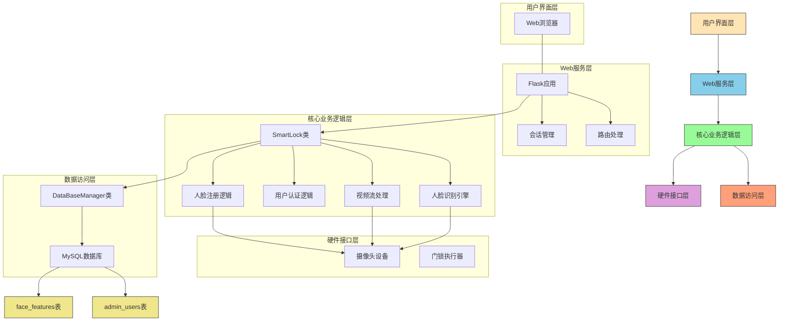
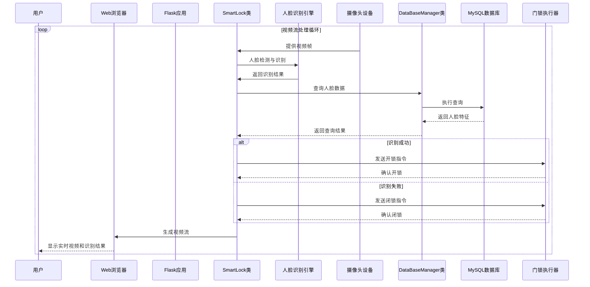
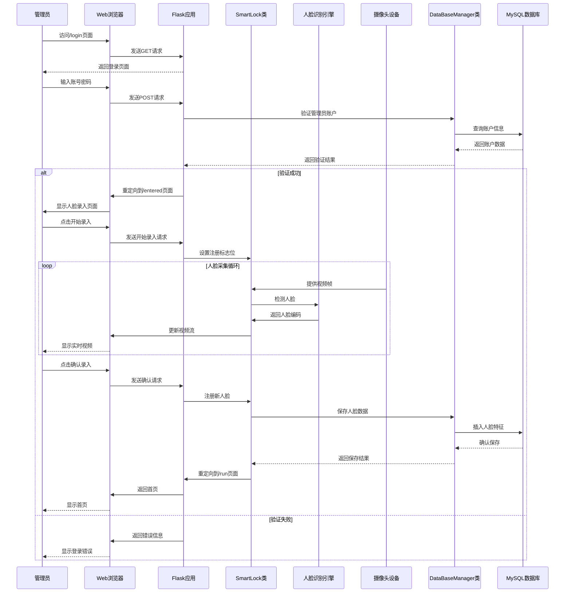

# 智能门锁系统架构图

## 架构层次说明

### 1. 用户界面层
- **Web浏览器**: 用户通过标准Web浏览器访问系统，当前不包含移动端应用程序接口

### 2. Web服务层
- **Flask应用**: 基于Python Flask框架构建的Web应用程序
- **路由处理**: 处理HTTP请求路由（/run, /login, /entered等）
- **会话管理**: 管理用户会话状态和身份认证

### 3. 核心业务逻辑层
- **SmartLock类**: 系统核心类，继承自DataBaseManager，整合所有业务功能
- **人脸识别引擎**: 基于face_recognition库实现的人脸检测与识别功能
- **视频流处理**: 实时处理摄像头视频流，生成HTTP视频流
- **用户认证逻辑**: 管理管理员账户登录验证
- **人脸注册逻辑**: 处理新用户人脸数据采集与存储

### 4. 硬件接口层
- **摄像头设备**: 支持本地摄像头(设备0)和网络摄像头(IP摄像头)
- **门锁执行器**: 门锁控制硬件接口（代码中定义但未完全实现）

### 5. 数据访问层
- **DataBaseManager类**: 封装数据库操作的基类，提供连接管理和SQL执行功能
- **MySQL数据库**: 存储系统数据的关系型数据库管理系统

### 6. 数据库表结构
- **admin_users表**: 存储管理员账户信息（id, username, password等字段）
- **face_features表**: 存储用户人脸特征数据（id, username, face_encoding等字段）

## 数据流向说明

1. **用户访问**: 用户通过Web浏览器发起HTTP请求
2. **路由分发**: Flask应用根据URL路径分发请求到对应处理函数
3. **业务处理**: SmartLock类执行具体的业务逻辑处理
4. **数据操作**: 通过DataBaseManager类访问MySQL数据库
5. **硬件交互**: 与摄像头设备进行数据交互获取视频流
6. **结果返回**: 处理结果通过HTTP响应返回给用户浏览器

## 系统特性

1. **单体架构**: 所有功能模块集中在一个应用程序中
2. **Web优先**: 专为Web浏览器访问设计，暂无移动端接口
3. **实时处理**: 支持实时视频流处理和人脸识别
4. **模块化设计**: 数据库操作独立封装，便于维护和扩展
5. **会话安全**: 通过Flask Session管理用户认证状态

## 时序图

### 1. 人脸识别开门流程

### 2. 人脸注册流程

